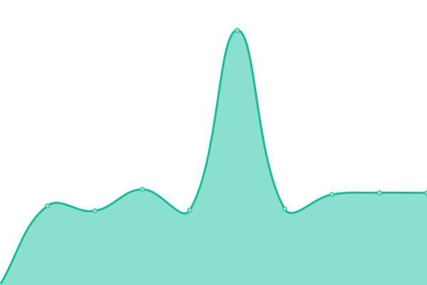
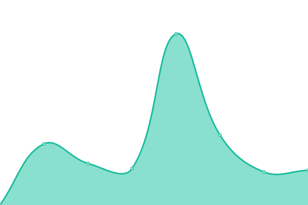

# [📈 Live Status](https://demo.upptime.js.org): <!--live status--> **🟧 Partial outage**

This repository contains the open-source uptime monitor and status page for [Upptime](https://upptime.js.org), powered by [Upptime](https://github.com/upptime/upptime).

With [Upptime](https://upptime.js.org), you can get your own unlimited and free uptime monitor and status page, powered entirely by a GitHub repository. We use [Issues](https://github.com/upptime/upptime/issues) as incident reports, [Actions](https://github.com/Coltrane-Hyde/ch-uptime/actions) as uptime monitors, and [Pages](https://demo.upptime.js.org) for the status page.

<!--start: status pages-->
<!-- This summary is generated by Upptime (https://github.com/upptime/upptime) -->
<!-- Do not edit this manually, your changes will be overwritten -->
<!-- prettier-ignore -->
| URL | Status | History | Response Time | Uptime |
| --- | ------ | ------- | ------------- | ------ |
|  [ColtraneHyde](https://coltranehyde.com) | 🟩 Up | [coltrane-hyde.yml](https://github.com/Coltrane-Hyde/ch-uptime/commits/HEAD/history/coltrane-hyde.yml) | 

 517ms
     
 | 

<a href="https://Coltrane-Hyde.github.io/ch-uptime/history/coltrane-hyde">100.00%</a>
    

|  [Leaner MVP Website](https://leanermvp.com) | 🟩 Up | [leaner-mvp-website.yml](https://github.com/Coltrane-Hyde/ch-uptime/commits/HEAD/history/leaner-mvp-website.yml) | 

 906ms
     
 | 

<a href="https://Coltrane-Hyde.github.io/ch-uptime/history/leaner-mvp-website">99.83%</a>
    

|  [Leaner MVP Platform](https://platform.leanermvp.com) | 🟩 Up | [leaner-mvp-platform.yml](https://github.com/Coltrane-Hyde/ch-uptime/commits/HEAD/history/leaner-mvp-platform.yml) | 

 235ms
     
 | 

<a href="https://Coltrane-Hyde.github.io/ch-uptime/history/leaner-mvp-platform">100.00%</a>
    

|  [SPP Prod](https://sigmapiphi.com) | 🟩 Up | [spp-prod.yml](https://github.com/Coltrane-Hyde/ch-uptime/commits/HEAD/history/spp-prod.yml) | 

 255ms
     
 | 

<a href="https://Coltrane-Hyde.github.io/ch-uptime/history/spp-prod">100.00%</a>
    

|  [B2T Private](https://private.theb2t.com) | 🟩 Up | [b2-t-private.yml](https://github.com/Coltrane-Hyde/ch-uptime/commits/HEAD/history/b2-t-private.yml) | 

 230ms
     
 | 

<a href="https://Coltrane-Hyde.github.io/ch-uptime/history/b2-t-private">100.00%</a>
    

|  [TBG Prod](https://tbgplatform.com) | 🟩 Up | [tbg-prod.yml](https://github.com/Coltrane-Hyde/ch-uptime/commits/HEAD/history/tbg-prod.yml) | 

 264ms
     
 | 

<a href="https://Coltrane-Hyde.github.io/ch-uptime/history/tbg-prod">100.00%</a>
    

|  [B2T Website Prod](https://theb2t.com) | 🟩 Up | [b2-t-website-prod.yml](https://github.com/Coltrane-Hyde/ch-uptime/commits/HEAD/history/b2-t-website-prod.yml) | 

 651ms
     
 | 

<a href="https://Coltrane-Hyde.github.io/ch-uptime/history/b2-t-website-prod">59.38%</a>
    

|  [B2T Website Staging](https://staging.theb2t.com/) | 🟥 Down | [b2-t-website-staging.yml](https://github.com/Coltrane-Hyde/ch-uptime/commits/HEAD/history/b2-t-website-staging.yml) | 

 0ms
     
 | 

<a href="https://Coltrane-Hyde.github.io/ch-uptime/history/b2-t-website-staging">0.00%</a>
    

<!--end: status pages-->

[**Visit our status website →**](https://demo.upptime.js.org)

## 📄 License

- Powered by: [Upptime](https://github.com/upptime/upptime)
- Code: [MIT](./LICENSE) © [Anand Chowdhary](https://anandchowdhary.com), supported by [Pabio](https://pabio.com)
- Data in the `./history` directory: [Open Database License](https://opendatacommons.org/licenses/odbl/1-0/)
